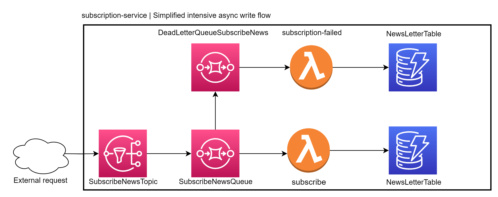

<meta charset="utf-8">

<h1 align="center">
subscription service
</h1>

  

 

  

  
  
  

  <a href="#-project">Project</a>&nbsp;&nbsp;&nbsp;|&nbsp;&nbsp;&nbsp;
  <a href="#-technologies">Technologies</a>&nbsp;&nbsp;&nbsp;|&nbsp;&nbsp;&nbsp;
  <a href="#-documentation">Documentation</a>&nbsp;&nbsp;&nbsp;|&nbsp;&nbsp;&nbsp;
  <a href="#%EF%B8%8F-how-to-contribute">How to contribute</a>

 

## 💻 Project

A service to support intensive writing operations like readers' subscriptions to newsletters.

## 🚀 Technologies

The project is based on the following technologies:

- [🚀 Node.js](https://nodejs.org/en/) — A JavaScript runtime built on Chrome's V8 JavaScript engine.
- [✨ Serverless Framework](https://www.serverless.com) — A framework to build serverless applications.
- [💻 Localstack](https://docs.localstack.cloud/getting-started/installation/) — Run AWS services locally.
- [🐋 Docker](https://www.docker.com) — A set of platform as a service products that use OS-level virtualization to deliver software in packages called containers.
- [📦 AWS SDK](https://aws.amazon.com/sdk-for-node-js/) — The official AWS SDK for JavaScript, available for browsers and mobile devices, or Node.js backends.
- [📦 ESLint](https://eslint.org) — A fully pluggable tool for identifying and reporting on patterns in JavaScript.
- [📦 Prettier](https://prettier.io) — A tool to keep code style consistent.
- [📦 Jest](https://jestjs.io) — A JavaScript Testing Framework with a focus on simplicity.
  And more...

## 🔖 Documentation

I'm working on a [Useful commands file](./docs/commands.md) to help you with the development process.
And bellow you can find how to solve some common issues.

### Common Issues

#### LocalStack DynamoDB Endpoint

You should configure the LOCALSTACK_ENDPOINT environment variable with the value http://localhost:4566 for LocalStack to function correctly. If you encounter a connection error, consider the following options:

- If you are using WSL, check the IP using `hostname -I | awk '{print $1}'` for your WSL, and use it as the HOST value in the LOCALSTACK_ENDPOINT environment variable in the `serverless.yml` file.
- If you are using MacOS, check the IP using `ipconfig getifaddr en0` for your Mac, and use it as the HOST value in the LOCALSTACK_ENDPOINT environment variable in the `serverless.yml`.

## ♻️ How to contribute

- Fork this repository;
- Create a new branch with your feature: `git checkout -b feature/my-feature`;
- Commit your changes: `git commit -m 'feat: awesome feature'`;
- Push to your branch: `git push origin feature/my-feature`.

Once your pull request has been merged, you can delete your branch.

---

Made with 💙 & ☕  by <strong><a href="https://www.linkedin.com/in/joaobispo2077/">João Bispo</a>😠</strong> 

